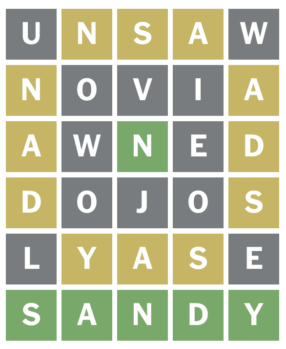
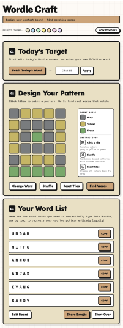

> Design your perfect board · Find matching words


## What is this?

Most Wordle grids are luck. This one is yours to design.
Paint any pattern. Wordle Craft finds the real words to make it happen.

---

<table>
<tr>
<td valign="top" width="66%">

## How it works

Wordle Craft walks you through three steps:

1. **Set a target** — fetch today's Wordle answer or enter a custom word
2. **Paint a pattern** — click tiles to assign green, yellow, or gray colors
3. **Get your words** — the app finds valid dictionary words that match your pattern

**Example output** for target word `SANDY`: 



## Features

- 🎨 **7 themes** — swap color palettes to match your style
- 🔀 **Shuffle** — randomly repaint the grid for inspiration
- 📋 **One-click copy** — copy each word individually to clipboard
- 📖 **Real words only** — every suggestion is a valid Wordle guess
- ⚡ **No backend** — runs entirely in the browser, zero latency


</td>
<td valign="top" width="34%">




</td>
</tr>
</table>

--- 

## Contributing

Bug reports and pull requests are all welcome.

**Reporting a bug** — open an [issue](https://github.com/luleoa12/wordle_craft/issues) and include steps to reproduce, your browser, and a screenshot if relevant.

**Submitting a pull request:**
```bash
git checkout -b my-feature
# make your changes
git commit -m "describe what changed"
git push origin my-feature
```
Then open a PR with a short description of what you changed and why.


 
